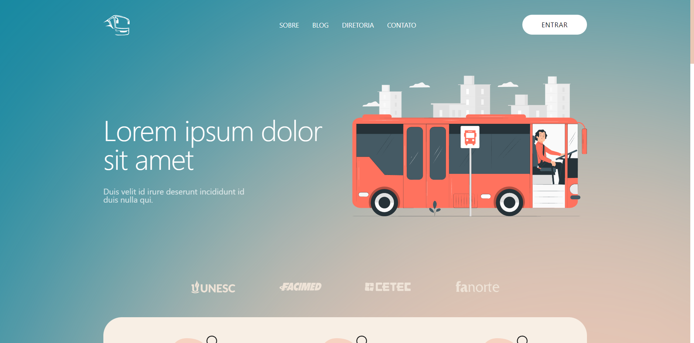

<p align="center">
  <a href="#-projeto">Projeto</a>&nbsp;&nbsp;&nbsp;|&nbsp;&nbsp;&nbsp;
  <a href="#rocket-tecnologias">Tecnologias</a>&nbsp;&nbsp;&nbsp;|&nbsp;&nbsp;&nbsp;
  <a href="#rocket-executando">Executando</a>&nbsp;&nbsp;&nbsp;|&nbsp;&nbsp;&nbsp;
  <a href="#memo-licença">Licença</a>
</p>
<br>

## 💻 Projeto

Esse projeto foi desenvolvido com o objetivo de servir como Trabalho de Conclusão de Curso e entregue à UNESC - Faculdades Integradas de Cacoal. Trata-se de um projeto para o gereciamento de associações que fornecem o transporte de universitários. 

## 🎨 Layout

<p align="center">
    
</p>

## :rocket: Tecnologias

Esse projeto foi desenvolvido com as seguintes tecnologias:

- [Laravel](https://laravel.com)
- [Docker](https://www.docker.com/)
- [MySQL](https://www.mysql.com)
- [NGINX](https://www.nginx.com)
- [Redis](https://redis.io)

## :notebook: Executando

```bash
# Clone este repositório
$ git clone https://github.com/ZeusBroddy/laramanager.git

# Acesse a pasta do projeto no seu terminal/cmd
$ cd laramanager

# Instale as dependências
$ composer install
$ npm install

# Gere a key do projeto Laravel
$ php artisan key:generate

# Crie link para o storage
$ php artisan storage:link

# Execute as migrations e seeds
# o seed de users irá demorar um pouco a mais, pois é cadastrado cada usuário no Stripe
$ php artisan migrate —seed

# Para executar a geração de cobranças para o mês atual
$ php artisan billing:generate

# Usuário administrador criado durante o seed → admin@auma.com e senha 12345678
```

## :memo: Licença

Esse projeto está sob a licença MIT. Veja o arquivo [LICENSE](LICENSE.md) para mais detalhes.
